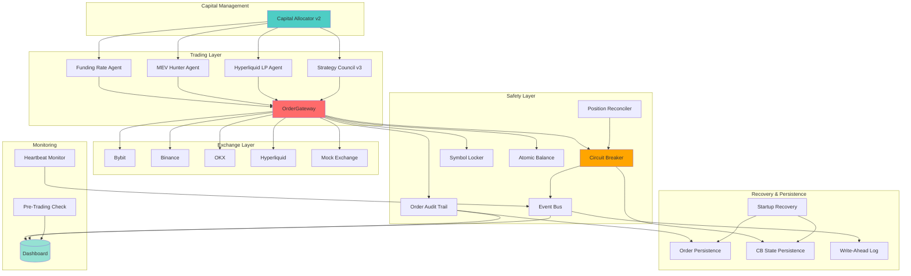

# 🚀 Crypto Swarm Trading Bot

> **The most sophisticated open-source crypto trading system you'll ever deploy.** Production-grade algorithmic trading with autonomous strategy evolution, capital-preservation guarantees, and real-time monitoring—all in one battle-tested package.

[](https://www.python.org/)
[](LICENSE)
[](https://streamlit.io/)
[](https://www.docker.com/)

---

## ⚡ What This Is

This isn't a hobby project. This is a **legitimate private automated fund** in open-source form. Three live trading engines (funding rate arbitrage, MEV liquidation hunting, Hyperliquid market making) orchestrated by a self-evolving strategy council, protected by bank-level reliability patterns, monitored through a real-time dashboard that would make a quant desk jealous.

**Mission Statement:** *"The system will not lose your money."* Every architectural decision flows from capital preservation. Every order goes through a transactional gateway that enforces circuit breakers, idempotency, state recovery, and position reconciliation. This is the infrastructure you'd build for a $10M fund, open-sourced.

---

## 🎯 Quick Demo


*Real-time dashboard showing live P&L, agent performance, risk metrics, and order flow. [See full dashboard documentation →](#-dashboard)*

---

## 🏗️ Architecture



**Key Architectural Principles:**

- **OrderGateway is the Single Source of Truth** — All orders flow through one transactional gateway that enforces every safety check
- **Circuit Breaker with DRAINING State** — Gracefully completes in-flight orders before halting trading
- **Idempotent Everything** — Deterministic client order IDs ensure no duplicate orders on retry
- **State Recovery on Startup** — Complete order and position verification before allowing new trading
- **Write-Ahead Logging** — Critical events persisted to disk before acknowledgment
- **Position Reconciliation** — Automatic mismatch detection with auto-correction within tolerance

---

## 📑 Table of Contents

- [Quick Start](#-quick-start)
- [Features](#-features)
- [Dashboard](#-dashboard)
- [Simulation & Backtesting](#-simulation--backtesting)
- [Risk Management & Reliability](#-risk-management--reliability)
- [API Documentation](#-api-documentation)
- [Project Structure](#-project-structure)
- [Development Guide](#-development-guide)
- [Security & Safety](#-security--safety-guarantees)
- [Roadmap](#-roadmap)
- [Disclaimer](#-disclaimer)

---

## ⚡ Quick Start

### 1. Clone & Setup

```bash
git clone https://github.com/ianmxaof/crypto-bot.git
cd crypto_bot
cp .env.example .env  # Create .env file
```

### 2. Configure Environment

Edit `.env` and add your exchange API keys:

```env
# Exchange Credentials (at least one required)
BYBIT_API_KEY=your_bybit_key
BYBIT_API_SECRET=your_bybit_secret

# Optional: Additional exchanges
BINANCE_API_KEY=your_binance_key
BINANCE_API_SECRET=your_binance_secret
OKX_API_KEY=your_okx_key
OKX_API_SECRET=your_okx_secret

# MEV Hunting (Solana)
HELIUS_API_KEY=your_helius_key  # Get free at https://helius.xyz

# Trading Configuration
STARTING_CAPITAL=10000
PAPER_TRADING=true  # ⚠️ KEEP TRUE FOR TESTING
SIMULATION_STARTING_BALANCE=10000

# Safety Defaults
LOG_LEVEL=INFO
```

### 3. Run It

**Terminal 1: Start the bot**
```bash
python main.py
```

**Terminal 2: Launch dashboard**
```bash
python run_dashboard.py
```

**Open:** `http://localhost:8501` in your browser.

---

## 🎯 Features

| Strategy | Expected APR | Risk Profile | Status | Description |
|----------|-------------|--------------|--------|-------------|
| 🎯 **Funding Rate Arbitrage** | 80-250% | Low | ✅ Live | Delta-neutral perpetual funding collection with daily hot-coin rotation |
| ⚡ **MEV Liquidation Hunter** | 300-1500%+ | High | ✅ Live | Real-time Solana liquidation detection via Helius + Jito bundle execution |
| 💧 **Hyperliquid LP** | 120-420% | Medium | ✅ Live | Delta-neutral market making with dynamic volatility-based spreads (<9% max DD) |
| 🧠 **Strategy Council v3** | Variable | Variable | ✅ Live | Autonomous strategy invention, weighted voting, and deployment |
| 📊 **Kelly Allocator v2** | Optimized | Managed | ✅ Live | Kelly-optimal capital allocation with correlation hedging |

**Production-Grade Infrastructure:**

- ✅ **Multi-Exchange Support** — Bybit, Binance, OKX, Hyperliquid + production mock exchange
- ✅ **OrderGateway** — Single transactional order submission path with complete safety enforcement
- ✅ **Circuit Breaker with DRAINING** — Graceful shutdown on excessive losses
- ✅ **Idempotent Order Submission** — Deterministic client order IDs prevent duplicates
- ✅ **Position Reconciliation** — Auto-correction within tolerance, halt on persistent mismatches
- ✅ **State Recovery** — Complete startup verification before allowing trading
- ✅ **Write-Ahead Logging** — Critical events never lost
- ✅ **Real-Time Dashboard** — 7-page Streamlit monitoring cockpit
- ✅ **Backtesting Framework** — Historical strategy validation with CoinGecko data
- ✅ **Pre-Trading Validation** — 9-point safety checklist before each session
- ✅ **Chaos Testing** — Kill process, inject latency, simulate failures

---

## 📊 Dashboard

The Streamlit dashboard is your command center. Seven pages of real-time monitoring, controls, and analytics.

### Home / Overview
**Live system health at a glance**
- Total P&L and portfolio balance
- Agent activity status
- Circuit breaker state
- System heartbeat status
- Quick action buttons

### 📈 Agent Performance
**Deep dive into each strategy**
- P&L breakdown by agent
- Performance tables with Sharpe, APR, max drawdown
- Activity timeline
- Capital allocation visualization

### ⚠️ Risk Metrics
**Risk monitoring and limits**
- Circuit breaker state and history
- Position limits and utilization
- Daily P&L tracking
- Drawdown monitoring
- Risk limit configuration

### 📋 Order Flow & Trades
**Complete order lifecycle visibility**
- Order heatmap by symbol/time
- Recent trades with full audit trail
- Order statistics (filled, rejected, pending)
- Execution quality metrics

### 💰 Balance & Positions
**Capital tracking**
- Balance history charts
- Position breakdown by symbol
- Real-time position tracking
- Balance reconciliation status

### 🎮 Simulation Controls
**Control your paper trading simulation**
- Start/stop/pause simulation
- Adjust speed multiplier (1x to 1000x)
- Set target simulation days
- Export simulation data
- Cache management

### 📡 Real-Time Events
**Event bus monitoring**
- Live event stream
- Event statistics by topic
- Queue size and dropped events
- Critical event highlighting
- Event filtering and search

### 🧪 Backtesting
**Historical strategy validation**
- Run backtests from UI
- Select date ranges
- Compare multiple strategies
- Download performance reports
- Historical data visualization

---

## 🧪 Simulation & Backtesting

### Run a 1-Year Simulation in 10 Minutes

**From the Dashboard:**

1. Navigate to **Simulation Controls** page
2. Select your market (e.g., BTC, ETH, SOL)
3. Set **Speed**: 1000x (runs 1000x faster than real-time)
4. Set **Target Days**: 365
5. Click **Start Simulation**

At 1000x speed, a full year of trading simulation completes in **~8.8 hours of wall-clock time**, but you can run multiple shorter segments.

**From Command Line:**

```bash
# Run 30-day backtest
python scripts/run_backtest.py --strategy funding_rate --days 30

# Run with custom starting capital
python scripts/run_backtest.py --strategy hyperliquid_lp --days 90 --capital 50000
```

**Simulation Features:**

- Real market data from CoinGecko (live or historical)
- Accurate fee simulation
- Slippage modeling
- Position tracking with reconciliation
- Complete audit trail

---

## 🛡️ Risk Management & Reliability

This is where we separate from hobby projects. The **Opus 4.5 Reliability Audit** implementation ensures capital preservation through multiple layers of protection.

### OrderGateway: The Single Chokepoint

Every order **must** flow through `OrderGateway`. No exceptions. The gateway enforces:

1. **Circuit breaker check** (FIRST — before any state changes)
2. **Symbol lock acquisition** (prevents concurrent trades)
3. **Balance reservation** (atomic, thread-safe)
4. **Order validation** (exchange-specific checks)
5. **Idempotency check** (prevent duplicate orders)
6. **Exchange submission** (with timeout handling)
7. **Order status tracking** (poll until filled/rejected)
8. **Position update** (with verification)
9. **Audit trail persistence** (complete order history)

**Failure Handling:**
- Circuit breaker blocks → Return error, no state change
- Validation fails → Release balance/lock, return error
- Timeout occurs → **DO NOT release balance** (order may have executed), mark `PENDING_VERIFICATION`
- Exchange fails → Release balance/lock, persist audit trail

### Circuit Breaker with DRAINING State

Three states protect your capital:

- **CLOSED** — Normal operation, trading allowed
- **DRAINING** — Circuit breaker triggered, completing in-flight orders only
- **OPEN** — Trading halted, manual reset required
- **HALF_OPEN** — Testing recovery after cooldown period

**State Persistence:** Circuit breaker state is saved to disk. On startup, if state is OPEN, it stays OPEN (no auto-recovery). This prevents silent failures after crashes.

### Position Reconciliation Auto-Correction

**Within Tolerance (1%):**
- Auto-sync internal state to exchange state
- Log sync action
- Continue trading

**Beyond Tolerance (>1%):**
- Trigger circuit breaker (immediate OPEN)
- Cancel in-flight orders if possible
- Alert human operator
- Halt trading until manual intervention

**Persistent Mismatches (>3 consecutive):**
- Circuit breaker remains OPEN
- Do not transition to HALF_OPEN until reconciliation passes
- Escalate alert to critical priority

### Startup Recovery Sequence

On system startup, before allowing any trading:

1. Load circuit breaker state (if OPEN, stay OPEN)
2. Load pending/in-flight orders from persistence
3. For each in-flight order: Query exchange for status
4. Reconcile positions with exchange
5. Release orphaned balance reservations (only after verification)
6. **Only then** allow new trading

**If any step fails:** System refuses to start trading until manual intervention.

### Pre-Trading Checklist

Before each trading session, run `scripts/pre_trading_check.py`:

1. ✅ Circuit breaker state (must be CLOSED)
2. ✅ Position reconciliation (must pass)
3. ✅ Exchange connectivity (all exchanges reachable)
4. ✅ Balance verification (internal matches exchange)
5. ✅ No orphaned orders (all orders in terminal state)
6. ✅ Risk limits configured
7. ✅ Alerts configured (Pushover/Twilio)
8. ✅ Order audit trail database accessible
9. ✅ Write-ahead log directory writable

**If any check fails:** Trading is blocked until resolved.

---

## 📚 API Documentation

### Exchange Base API

Unified interface for all exchange implementations.

**Core Methods:**

| Method | Description | Returns |
|--------|-------------|---------|
| `fetch_balance(currency: Optional[str])` | Get account balance | `Dict[str, Balance]` |
| `fetch_positions(symbol: Optional[str])` | Get open positions | `List[Position]` |
| `create_market_order(symbol, side, amount, params, client_order_id)` | Submit market order | `Order` |
| `create_limit_order(symbol, side, amount, price, params, client_order_id)` | Submit limit order | `Order` |
| `fetch_order(order_id, symbol)` | Get order status | `Order` |
| `fetch_order_by_client_id(client_order_id, symbol)` | Get order by client ID (idempotency) | `Optional[Order]` |
| `cancel_order(order_id, symbol)` | Cancel order | `bool` |
| `fetch_funding_rates(symbols)` | Get funding rates | `Dict[str, FundingRate]` |
| `set_leverage(leverage, symbol)` | Set leverage | `bool` |
| `fetch_ticker(symbol)` | Get price data | `Dict[str, Any]` |
| `close_position(symbol, side)` | Close position | `bool` |
| `validate_order(symbol, side, amount, price, order_type)` | Pre-submission validation | `OrderValidationResult` |

**Example:**

```python
from exchanges.bybit_client import BybitExchange

exchange = BybitExchange(api_key, api_secret, testnet=True)
balance = await exchange.fetch_balance("USDT")
positions = await exchange.fetch_positions()

# All exchanges implement the same interface
```

### Agent Base API

Base class for all trading agents.

**Key Methods:**

| Method | Description | Returns |
|--------|-------------|---------|
| `run()` | Main agent loop (async) | `None` |
| `on_stop()` | Cleanup handler | `None` |
| `evaluate_opportunity(market_state)` | Calculate expected yield | `Decimal` |
| `execute(allocation)` | Execute strategy with capital | `Dict` |

**Example:**

```python
from core.agent_base import Agent, AgentConfig

class MyStrategy(Agent):
    def __init__(self):
        super().__init__(AgentConfig(
            name="my_strategy_v1",
            version="1.0.0",
            description="My awesome strategy"
        ))
    
    async def run(self):
        while not self._shutdown_event.is_set():
            # Your trading logic here
            await asyncio.sleep(60)
```

### OrderGateway API

**The single path to order submission.** All agents must use this.

| Method | Description | Returns |
|--------|-------------|---------|
| `submit_market_order(agent_id, symbol, side, amount, currency, params)` | Submit market order with full safety checks | `Order` |

**Example:**

```python
from core.order_gateway import OrderGateway
from risk.circuit_breaker import CircuitBreaker
from core.symbol_locker import SymbolLocker

gateway = OrderGateway(
    exchange=exchange,
    circuit_breaker=circuit_breaker,
    symbol_locker=symbol_locker,
    balance_manager=balance_manager,
    order_persistence=order_persistence
)

# All safety checks enforced automatically
order = await gateway.submit_market_order(
    agent_id="my_agent",
    symbol="BTC/USDT",
    side="buy",
    amount=Decimal("0.1")
)
```

### Event Bus API

Pub/sub event system with backpressure and critical event prioritization.

**Key Methods:**

| Method | Description |
|--------|-------------|
| `publish(topic, data, source)` | Publish event (sync, queues for async) |
| `publish_async(topic, data, source)` | Publish event (async) |
| `subscribe(topic, callback, async_callback)` | Subscribe to events |
| `unsubscribe(topic, callback)` | Unsubscribe |
| `subscribe_async(topic)` | Get async iterator for events |

**Critical Topics** (never dropped):
- `risk:circuit_breaker`
- `risk:position_mismatch`
- `risk:alert`
- `system:critical`
- `system:error`

**Example:**

```python
from core.event_bus import event_bus

# Publish event
event_bus.publish("trade:executed", {
    "symbol": "BTC/USDT",
    "side": "buy",
    "amount": 0.1,
    "price": 50000
}, source="my_agent")

# Subscribe
def handle_trade(event):
    print(f"Trade executed: {event.data}")

event_bus.subscribe("trade:executed", handle_trade)

# Async subscription
async for event in event_bus.subscribe_async("trade:executed"):
    print(event.data)
```

### ChronologicalMemory API

Persistent chronological storage for P&L tracking and historical data.

**Key Methods:**

| Method | Description | Returns |
|--------|-------------|---------|
| `append(data)` | Add entry | `None` |
| `get_recent(count)` | Get most recent entries | `List[Dict]` |
| `get_all()` | Get all entries | `List[Dict]` |

**Example:**

```python
from core.memory.chrono import ChronologicalMemory

memory = ChronologicalMemory(
    namespace="my_strategy_pnl",
    persist_path=Path("data/memory/my_strategy.json")
)

memory.append({
    "timestamp": datetime.now(timezone.utc).isoformat(),
    "pnl": 150.50,
    "balance": 10150.50,
    "agent": "my_agent",
    "symbol": "BTC/USDT"
})
```

### Circuit Breaker API

Risk control that halts trading on excessive losses.

**Key Methods:**

| Method | Description | Returns |
|--------|-------------|---------|
| `check(current_value)` | Check if trading allowed | `(bool, Optional[str])` |
| `register_order(order_id)` | Register in-flight order | `None` |
| `complete_order(order_id)` | Mark order complete | `None` |
| `wait_for_drain(timeout)` | Wait for in-flight orders | `bool` |
| `reset()` | Manually reset (persists state) | `None` |

**Example:**

```python
from risk.circuit_breaker import CircuitBreaker
from decimal import Decimal

circuit_breaker = CircuitBreaker(
    loss_threshold_percent=Decimal('0.10'),  # 10% loss triggers
    persistence_path=Path("data/circuit_breaker.json")
)

circuit_breaker.set_initial_capital(Decimal('10000'))
allowed, error = await circuit_breaker.check(current_portfolio_value)

if not allowed:
    logger.critical(f"Trading blocked: {error}")
```

---

## 📁 Project Structure

```
crypto_bot/
├── core/                          # Core framework
│   ├── order_gateway.py          # ⭐ Single order submission path
│   ├── order_audit.py            # Complete order audit trail
│   ├── order_persistence.py      # Order state persistence
│   ├── startup_recovery.py       # Startup recovery sequence
│   ├── event_bus.py              # Event-driven communication
│   ├── agent_base.py             # Base agent class
│   ├── symbol_locker.py          # Symbol-level locking
│   ├── rate_limiter.py           # API rate limiting
│   ├── heartbeat_monitor.py      # System health monitoring
│   ├── wal.py                    # Write-ahead log for critical events
│   └── memory/
│       └── chrono.py             # Chronological memory persistence
│
├── exchanges/                     # Exchange implementations
│   ├── base.py                   # Unified exchange interface
│   ├── bybit_client.py           # Bybit implementation
│   ├── binance_client.py         # Binance implementation
│   ├── okx_client.py             # OKX implementation
│   ├── hyperliquid_client.py     # Hyperliquid implementation
│   └── mock_exchange.py          # Production-grade mock exchange
│
├── agents/                        # Trading agents
│   └── crypto/
│       ├── funding_rate_agent.py       # Funding rate arbitrage
│       ├── mev_watcher_agent.py        # MEV liquidation hunter
│       ├── mev_helius_jito.py          # Helius + Jito integration
│       ├── hyperliquid_lp_agent.py     # Hyperliquid market making
│       ├── crypto_swarm_overseer.py    # Basic overseer
│       ├── swarm_capital_allocator_v2.py  # Kelly allocator
│       └── swarm_council_v3.py         # Strategy council
│
├── risk/                          # Risk management
│   ├── circuit_breaker.py        # Circuit breaker with DRAINING
│   ├── position_reconciler.py    # Position reconciliation + auto-correction
│   ├── limits.py                 # Risk limits
│   └── monitor.py                # Risk monitoring
│
├── simulation/                    # Simulation engine
│   ├── atomic_balance.py         # Thread-safe balance operations
│   ├── pnl_calculator.py         # P&L calculations
│   ├── position_tracker.py       # Position tracking
│   └── state_manager.py          # State management
│
├── dashboard/                     # Streamlit dashboard
│   ├── Home.py                   # Dashboard entry point
│   ├── components.py             # Reusable components
│   ├── data_service.py           # Data aggregation
│   └── pages/                    # Dashboard pages
│       ├── 1_Overview.py
│       ├── 2_Agent_Performance.py
│       ├── 3_Risk_Metrics.py
│       ├── 4_Order_Flow_&_Trades.py
│       ├── 5_Balance_&_Positions.py
│       ├── 6_Simulation_Controls.py
│       ├── 7_Real-Time_Events.py
│       └── 8_Backtesting.py
│
├── backtesting/                   # Backtesting framework
│   ├── backtester.py             # Backtesting engine
│   ├── data_loader.py            # Historical data loading
│   ├── metrics.py                # Performance metrics
│   └── reporter.py               # Report generation
│
├── data_providers/                # Market data
│   └── market_data.py            # CoinGecko API integration
│
├── monitoring/                    # Monitoring & alerting
│   ├── metrics_collector.py      # Metrics aggregation
│   └── alerting.py               # Alert system (Pushover/Twilio)
│
├── scripts/                       # Utility scripts
│   ├── pre_trading_check.py      # ⭐ 9-point safety checklist
│   ├── verify_env.py             # Environment verification
│   ├── run_backtest.py           # Backtest runner
│   └── generate_sample_data.py   # Sample data generation
│
├── tests/
│   ├── unit/                     # Unit tests
│   ├── integration/              # Integration tests
│   └── chaos/                    # ⭐ Chaos testing utilities
│       ├── kill_process.py       # Process killing tests
│       ├── inject_latency.py     # Latency injection
│       └── simulate_exchange_failure.py  # Exchange failure simulation
│
├── config/                        # Configuration
│   ├── settings.py               # Settings management
│   └── simulation_state.json     # Runtime simulation state
│
├── data/                          # Data storage
│   ├── memory/                   # ChronologicalMemory files
│   ├── wal/                      # Write-ahead log files
│   └── simulation_state.json     # Dashboard-controlled simulation state
│
├── main.py                        # Main entry point
├── run_dashboard.py               # Dashboard launcher
└── requirements.txt               # Python dependencies
```

---

## 🔧 Development Guide

### Adding a New Strategy

**Step 1: Create your agent class**

```python
# agents/crypto/my_strategy_agent.py
from core.agent_base import Agent, AgentConfig
from core.order_gateway import OrderGateway
from exchanges.base import BaseExchange
from decimal import Decimal

class MyStrategyAgent(Agent):
    def __init__(self, exchange: BaseExchange, order_gateway: OrderGateway):
        super().__init__(AgentConfig(
            name="my_strategy_v1",
            version="1.0.0",
            description="My awesome trading strategy"
        ))
        self.exchange = exchange
        self.order_gateway = order_gateway  # ⭐ REQUIRED
    
    async def run(self):
        while not self._shutdown_event.is_set():
            # Your trading logic
            try:
                # ⭐ MUST use OrderGateway, never exchange directly
                order = await self.order_gateway.submit_market_order(
                    agent_id=self.config.name,
                    symbol="BTC/USDT",
                    side="buy",
                    amount=Decimal("0.1")
                )
                logger.info(f"Order executed: {order.id}")
            except OrderGatewayError as e:
                logger.error(f"Order rejected: {e}")
            
            await asyncio.sleep(60)
```

**Step 2: Register with overseer**

```python
# main.py or your initialization code
from agents.crypto.my_strategy_agent import MyStrategyAgent

# Create OrderGateway (REQUIRED)
from core.order_gateway import OrderGateway
from risk.circuit_breaker import CircuitBreaker
from core.symbol_locker import SymbolLocker
from core.order_persistence import OrderPersistence
from pathlib import Path

circuit_breaker = CircuitBreaker(
    persistence_path=Path("data/circuit_breaker.json")
)
symbol_locker = SymbolLocker()
order_persistence = OrderPersistence(Path("data/orders.json"))

gateway = OrderGateway(
    exchange=exchange,
    circuit_breaker=circuit_breaker,
    symbol_locker=symbol_locker,
    balance_manager=balance_manager,  # If using simulation
    order_persistence=order_persistence
)

# Create and register agent
my_agent = MyStrategyAgent(exchange, gateway)
overseer.register_strategy(my_agent)
```

**Step 3: Test thoroughly**

```bash
# Run pre-trading checklist
python scripts/pre_trading_check.py

# Run in paper trading mode
PAPER_TRADING=true python main.py

# Monitor in dashboard
python run_dashboard.py
```

**Critical Requirements:**

- ✅ **Always use OrderGateway** — Never call `exchange.create_market_order()` directly
- ✅ **Use Money type** — Never use `float` in financial calculations
- ✅ **Handle exceptions** — OrderGatewayError means order was rejected (safety check)
- ✅ **Register orders** — Circuit breaker tracks in-flight orders automatically
- ✅ **Persist state** — OrderGateway handles persistence automatically

---

## 🔒 Security & Safety Guarantees

### Capital Preservation Guarantees

These aren't suggestions. These are **enforced guarantees**:

1. **No Direct Exchange Calls** — OrderGateway is the only path. Circuit breaker checked before every order.

2. **No Duplicate Orders** — Deterministic client order IDs + idempotency checks prevent retry duplicates.

3. **No Balance Leaks** — Atomic balance reservations with automatic rollback on failure.

4. **No Orphaned State** — Complete startup recovery verifies all in-flight orders and positions.

5. **No Lost Critical Events** — Write-ahead logging ensures risk events are never dropped.

6. **No Silent Failures** — Pre-trading checklist blocks trading if any system is unhealthy.

7. **No Float Contamination** — Money type enforces Decimal-only calculations (runtime + static checks).

8. **No Position Drift** — Position reconciliation auto-corrects within tolerance, halts beyond.

9. **No Race Conditions** — Symbol locking prevents concurrent trades on same symbol.

### Security Features

- **API Key Protection** — Never stored in code, always in environment variables
- **Secure Logging** — Automatic redaction of API keys, secrets, passwords from logs
- **Rate Limiting** — Prevents API bans and exchange violations
- **Testnet Support** — Safe testing without real capital risk

### Testing & Validation

- **Chaos Testing** — Kill process mid-order, verify recovery
- **Latency Injection** — Test timeout handling and duplicate prevention
- **Exchange Failure Simulation** — Test behavior on exchange API failures
- **24-Hour Soak Tests** — Run paper trading for 24 hours, verify no drift

---

## 🗺️ Roadmap

### Coming Soon

- **Grok AI Integration** — AI-powered strategy builder with natural language
- **On-Chain Deployment** — Deploy strategies as on-chain programs (Solana/Base)
- **Community Marketplace** — Share and trade strategies with other users
- **Mobile Alerts** — Pushover/Twilio integration for real-time notifications
- **DEX Wallet Support** — Direct wallet integration for DEX trading

### Under Consideration

- **Multi-Instance Load Balancing** — Run multiple bot instances with shared state
- **Redis Event Bus** — Distributed event bus for multi-instance deployments
- **REST API** — External API for monitoring and control
- **JWT Authentication** — Secure API access
- **Advanced Risk Models** — VaR, CVaR, stress testing

---

## ⚠️ Disclaimer

**This software is provided for educational and research purposes only.**

Trading cryptocurrencies carries significant risk of loss. Past performance does not guarantee future results. The authors and contributors are not responsible for any losses incurred from using this software.

**Key Points:**

- Always test thoroughly in paper trading mode before using real capital
- Start with small amounts and gradually increase
- Monitor your bot regularly
- Understand the strategies before deploying
- Use at your own risk

**The system is designed for capital preservation, but no software is perfect. Trade responsibly.**

---

## 📄 License

MIT License — See [LICENSE](LICENSE) file for details.

---

## 🙏 Acknowledgments

Built with insights from:
- Hummingbot's event-driven architecture
- Freqtrade's backtesting framework
- NautilusTrader's reliability patterns
- Production prop-shop best practices

**Special thanks to Opus 4.5 for the reliability audit that transformed this from a trading bot into a capital-preservation system.**

---

**Built with ❤️ for serious traders who want infrastructure, not toys.**

**Star this repo if you recognize production-grade when you see it. ⭐**
